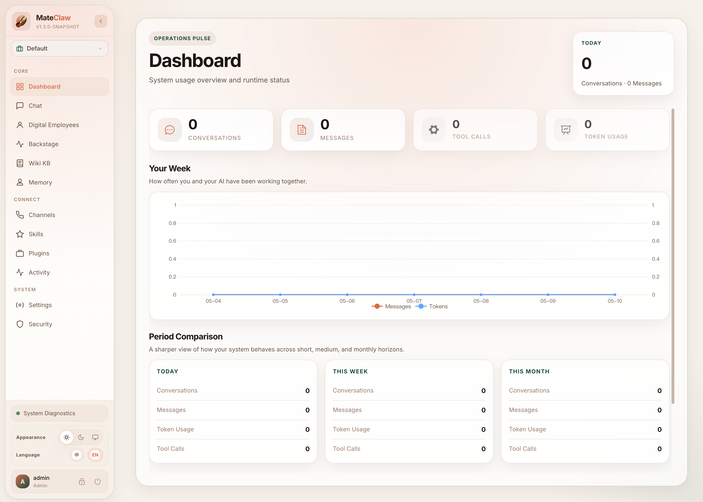
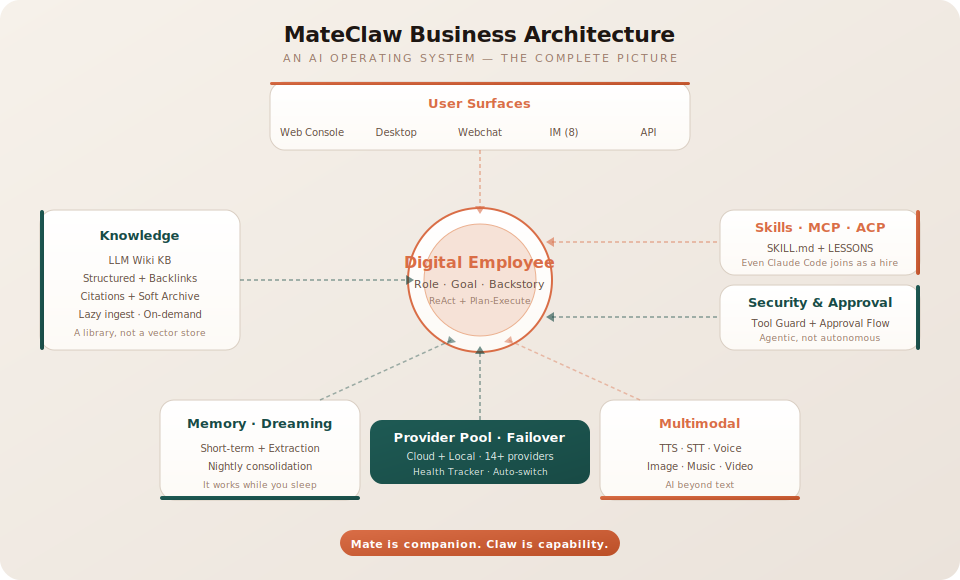

<div align="center">

<p align="center">
  
</p>

# MateClaw

<p align="center"><b>AI that thinks, acts, remembers — and keeps going when one model dies.</b></p>

[](https://github.com/matevip/mateclaw)
[](https://claw.mate.vip/docs)
[](https://claw-demo.mate.vip)
[](https://claw.mate.vip)
[](https://adoptium.net/)
[](https://spring.io/projects/spring-boot)
[](https://vuejs.org/)
[](https://github.com/matevip/mateclaw)
[](LICENSE)

[[Website](https://claw.mate.vip)] [[Live Demo](https://claw-demo.mate.vip)] [[Documentation](https://claw.mate.vip/docs)] [[中文](README_zh.md)]

</div>

<p align="center">
  
</p>

---

Most AI tools forget you the moment the tab closes. Most fall over when their model vendor has a bad day. Most give you a chatbox and call it a product.

**MateClaw is the whole widget.** One deployment. Reasoning, knowledge, memory, tools, and multi-channel presence — built together, not bolted on.

---

## Three things that make it different

### 1 · Your AI doesn't die when a model does

Primary key expired. Vendor returns 401. Network blip. Quota drained.

Other tools hand you a red error card. MateClaw routes to the next healthy provider — DashScope, OpenAI, Anthropic, Gemini, DeepSeek, Kimi, Ollama, LM Studio, MLX, 14+ in total — and the user sees the reply finish. A provider health tracker parks bad vendors in a cooldown window so they don't waste seconds on every turn.

You don't configure a retry script. You set priorities in the web UI. The runtime does the rest.

### 2 · Knowledge that links itself

Upload a PDF, a batch of markdown, a scraped page — raw material in.

MateClaw's **LLM Wiki** digests it into structured pages, builds `[[links]]` between them, and remembers where every sentence came from. Click a citation, see the exact source chunk. Ask a question, the page you get is stitched from the right chunks — with references you can verify.

This is the difference between a warehouse and a library.

### 3 · One product, five surfaces

| Surface | What it is |
|---|---|
| **Web Console** | Full admin — agents, models, tools, skills, knowledge, security, cron |
| **Desktop** | Electron app with a bundled JRE 21. Double-click, run. No Java install |
| **Webchat Widget** | One `<script>` tag embed. Drop it on any site |
| **IM Channels** | DingTalk · Feishu · WeChat Work · Telegram · Discord · QQ |
| **Plugin SDK** | Java module for third-party capability packs |

Same brain. Same memory. Same tools. Different doors.

---

## What's in the box

### Agent runtime
**ReAct** for iterative reasoning. **Plan-and-Execute** for complex multi-step work. Dynamic context pruning, smart truncation, stale-stream cleanup — the boring stuff that makes long conversations actually work.

### Knowledge & memory
- **LLM Wiki** — raw materials digest into linked pages with citations
- **Workspace memory** — `AGENTS.md`, `SOUL.md`, `PROFILE.md`, `MEMORY.md`, daily notes
- **Memory lifecycle** — post-conversation extraction, scheduled consolidation, dreaming workflows

### Tools, skills, MCP
Built-in tools for web search, files, memory, date/time. **MCP** over stdio / SSE / Streamable HTTP. **SKILL.md** packages from the ClawHub marketplace. A **Tool Guard** layer with RBAC, approval flows, and path protection — capability needs boundaries.

### Multimodal creation
Text-to-speech · Speech-to-text · Image · Music · Video. First-class, not add-ons.

### Enterprise-ready
RBAC + JWT. Full audit trail. Flyway-managed schema that auto-heals on upgrade. One JAR to ship. MySQL in production, H2 for dev — nothing to change in your code.

---

## Why MateClaw

| | MateClaw | Claude Code | Cursor | Windsurf |
|:---|:---:|:---:|:---:|:---:|
| **Multi-model failover** | Auto-route across vendors | Anthropic only | One model | One model |
| **Knowledge digestion** | Wiki with citations | CLAUDE.md only | Code index | — |
| **Multi-channel presence** | 7 IM + Web + Desktop + Widget | 3 IM preview | IDE only | IDE only |
| **Admin dashboard** | Full web console | Enterprise tier | — | — |
| **Price** | **Free · Apache 2.0** | $20–200/mo | $0–200/mo | $0–200/mo |

The comparison table everyone writes is the one that flatters themselves. This is the one that matters: in a category crowded with coding assistants, MateClaw's bet is **generality** — an AI operating system, not an IDE plugin.

---

## Quick start

```bash
# Backend
cd mateclaw-server
mvn spring-boot:run           # http://localhost:18088

# Frontend
cd mateclaw-ui
pnpm install && pnpm dev      # http://localhost:5173
```

Login: `admin` / `admin123`

### Docker

```bash
cp .env.example .env
docker compose up -d          # http://localhost:18080
```

### Desktop

Download from [GitHub Releases](https://github.com/matevip/mateclaw/releases). Bundles JRE 21. No Java install needed.

---

## Architecture

<p align="center">
  
</p>

<details>
<summary><b>Technical architecture</b></summary>
<p align="center">
  
</p>
</details>

---

## Project structure

```
mateclaw/
├── mateclaw-server/        Spring Boot 3.5 backend (Spring AI Alibaba, StateGraph runtime)
├── mateclaw-ui/            Vue 3 + TypeScript admin SPA (built into the server JAR)
├── mateclaw-desktop/       Electron app with bundled JRE 21
├── mateclaw-webchat/       Embeddable chat widget (UMD / ES bundles)
├── mateclaw-plugin-api/    Java SDK for third-party capability plugins
├── mateclaw-plugin-sample/ Reference plugin implementation
├── matevip-sites/          Marketing site + VitePress docs (pnpm workspace)
├── deploy/                 Production deployment configs
├── docker-compose.yml
└── .env.example
```

## Tech stack

| Layer | Technology |
|---|---|
| Backend | Spring Boot 3.5 · Spring AI Alibaba 1.1 · MyBatis Plus · Flyway |
| Agent | StateGraph runtime · ReAct + Plan-Execute |
| Database | H2 (dev) · MySQL 8.0+ (prod) |
| Auth | Spring Security + JWT |
| Frontend | Vue 3 · TypeScript · Vite · Element Plus · TailwindCSS 4 |
| Desktop | Electron · electron-updater · JRE 21 (bundled) |
| Widget | Vite library mode · UMD + ES bundles |

---

## Documentation

Full docs at **[claw.mate.vip/docs](https://claw.mate.vip/docs)** — setup, architecture, each subsystem, API reference.

## Roadmap

Sharper multi-agent collaboration · Smarter model routing · Deeper multimodal understanding · Longer-lived memory · A richer ClawHub.

## Contributing

```bash
git clone https://github.com/matevip/mateclaw.git
cd mateclaw
cd mateclaw-server && mvn clean compile
cd ../mateclaw-ui && pnpm install && pnpm dev
```

---

## Why the name

**Mate** is companion. **Claw** is capability.

Something that stays with you — and grabs work and moves it.

## License

[Apache License 2.0](LICENSE). No asterisks.
