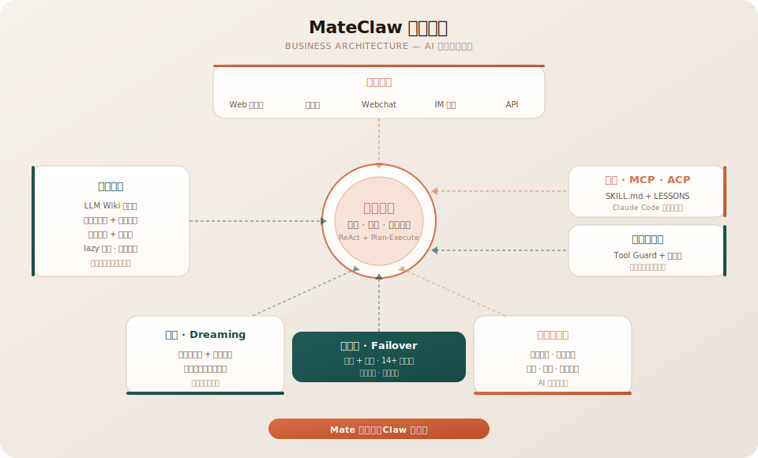
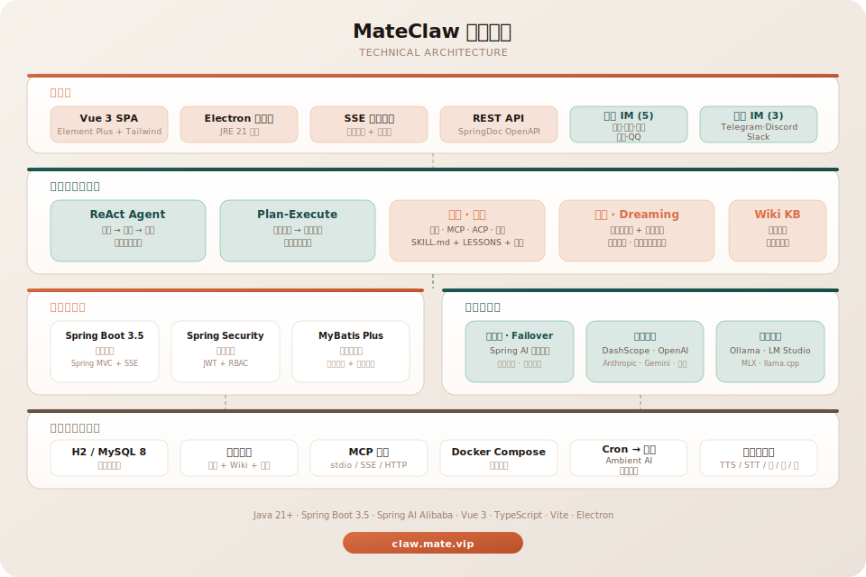

<div align="center">

<p align="center">
  
</p>

# MateClaw

<p align="center"><b>会思考、会行动、会记忆的 AI——主模型挂了，它还能继续干活。</b></p>

[](https://github.com/matevip/mateclaw)
[](https://claw.mate.vip/docs)
[](https://claw-demo.mate.vip)
[](https://claw.mate.vip)
[](https://adoptium.net/)
[](https://spring.io/projects/spring-boot)
[](https://vuejs.org/)
[](https://github.com/matevip/mateclaw)
[](LICENSE)

[[官网](https://claw.mate.vip)] [[在线演示](https://claw-demo.mate.vip)] [[文档](https://claw.mate.vip/docs)] [[English](README.md)]

</div>

<p align="center">
  
</p>

---

大多数 AI 工具一关标签页就忘了你是谁。供应商一抽风就两手一摊。给你一个聊天框，就敢叫产品。

**MateClaw 是完整的一整套。** 一次部署——推理、知识、记忆、工具、多渠道入口，从第一天就是一起设计的，不是事后拼接的。

---

## 三件让它与众不同的事

### 1 · 模型挂了，AI 不挂

Key 过期。厂商返回 401。网络抖动。配额耗尽。

别的工具丢你一张红色错误卡。MateClaw 自动切到下一家健康的供应商——DashScope、OpenAI、Anthropic、Gemini、DeepSeek、Kimi、Ollama、LM Studio、MLX，共 14+ 家——用户只会看到回答正常完成。内置的 **Provider Health Tracker** 会把连续失败的供应商放进冷却窗口，避免每一轮对话都白白撞壁。

你不用写重试脚本。在 Web UI 里设定好失败转移优先级，运行时自己搞定。

### 2 · 知识会自己长出链接

上传 PDF、一批 markdown、抓下来的网页——原始材料进去。

MateClaw 的 **LLM Wiki** 把它消化成结构化页面，页面之间自己长出 `[[链接]]`，每一句话都记得来自哪里。点开引用抽屉，就能看到原始 chunk。问一个问题，得到的页面是从对应片段拼出来的——带可核对的出处。

这是**仓库**和**图书馆**的区别。

### 3 · 一个产品，五个入口

| 入口 | 它是什么 |
|---|---|
| **Web 控制台** | 完整的管理后台——智能体、模型、工具、技能、知识、安全、定时任务 |
| **桌面端** | Electron + 内嵌 JRE 21，双击即用，无需装 Java |
| **网页嵌入式聊天** | 一个 `<script>` 标签就能嵌进任何网站 |
| **IM 渠道** | 钉钉 · 飞书 · 企业微信 · Telegram · Discord · QQ |
| **插件 SDK** | Java 模块，供第三方扩展能力包 |

同一个大脑。同一份记忆。同一套工具。不同的门。

---

## 盒子里有什么

### 智能体引擎
**ReAct** 做迭代推理。**Plan-and-Execute** 做复杂多步任务。动态上下文裁剪、智能截断、僵死流清理——让长对话真正能用的那些"不起眼"的基础设施。

### 知识与记忆
- **LLM Wiki** — 原始材料消化成有链接、带引用的结构化页面
- **工作区记忆** — `AGENTS.md` / `SOUL.md` / `PROFILE.md` / `MEMORY.md` / 每日笔记
- **记忆生命周期** — 对话后自动提取 · 定时整理 · 记忆涌现工作流

### 工具、技能、MCP
内置工具覆盖搜索、文件、记忆、日期。**MCP** 支持 stdio / SSE / Streamable HTTP 三种传输。**SKILL.md** 包可从 ClawHub 市场安装。**工具防护**层提供 RBAC、审批流、文件路径保护——能力必须有边界。

### 多模态创作
语音合成 · 语音识别 · 图片 · 音乐 · 视频。一等公民，不是附加插件。

### 企业就绪
RBAC + JWT。完整审计事件流。Flyway 管理数据库 schema，升级时自愈。一个 JAR 交付。生产用 MySQL，开发用 H2，代码零改动。

---

## 为什么选 MateClaw

| | MateClaw | Claude Code | Cursor | Windsurf |
|:---|:---:|:---:|:---:|:---:|
| **多模型自动切换** | 跨厂商自动路由 | 仅 Anthropic | 单模型 | 单模型 |
| **知识消化式加工** | Wiki + 引用溯源 | 仅 CLAUDE.md | 代码索引 | — |
| **多渠道入口** | 7 IM + Web + 桌面 + 嵌入 | 预览 3 渠道 | 仅 IDE | 仅 IDE |
| **管理仪表盘** | 完整 Web 控制台 | 企业版 | — | — |
| **价格** | **免费 · Apache 2.0** | $20–200/月 | $0–200/月 | $0–200/月 |

每个产品写的对比表都是对自己有利的。这张表要说的是：在编码助手扎堆的赛道里，MateClaw 下的注是**通用性**——AI 操作系统，不是 IDE 插件。

---

## 快速开始

```bash
# 后端
cd mateclaw-server
mvn spring-boot:run           # http://localhost:18088

# 前端
cd mateclaw-ui
pnpm install && pnpm dev      # http://localhost:5173
```

默认登录：`admin` / `admin123`

### Docker 部署

```bash
cp .env.example .env
docker compose up -d          # http://localhost:18080
```

### 桌面端

从 [GitHub Releases](https://github.com/matevip/mateclaw/releases) 下载安装包。内嵌 JRE 21，无需额外装 Java。

---

## 架构全景

<p align="center">
  
</p>

<details>
<summary><b>技术架构</b></summary>
<p align="center">
  
</p>
</details>

---

## 项目结构

```
mateclaw/
├── mateclaw-server/        Spring Boot 3.5 后端（Spring AI Alibaba · StateGraph 运行时）
├── mateclaw-ui/            Vue 3 + TypeScript 管理 SPA（构建产物打进后端 JAR）
├── mateclaw-desktop/       Electron 桌面端（内嵌 JRE 21）
├── mateclaw-webchat/       网页嵌入式聊天组件（UMD / ES bundle）
├── mateclaw-plugin-api/    第三方能力插件的 Java SDK
├── mateclaw-plugin-sample/ 参考插件实现
├── matevip-sites/          官网 + VitePress 文档站（pnpm workspace）
├── deploy/                 生产部署配置
├── docker-compose.yml
└── .env.example
```

## 技术栈

| 层次 | 技术 |
|---|---|
| 后端 | Spring Boot 3.5 · Spring AI Alibaba 1.1 · MyBatis Plus · Flyway |
| 智能体 | StateGraph 运行时 · ReAct + Plan-Execute |
| 数据库 | H2（开发）· MySQL 8.0+（生产）|
| 认证 | Spring Security + JWT |
| 前端 | Vue 3 · TypeScript · Vite · Element Plus · TailwindCSS 4 |
| 桌面端 | Electron · electron-updater · 内嵌 JRE 21 |
| Webchat | Vite library 模式 · UMD + ES bundle |

---

## 文档

完整文档 **[claw.mate.vip/docs](https://claw.mate.vip/docs)**——安装、架构、各子系统、API 参考。

## 路线图

更强的多智能体协作 · 更智能的模型路由 · 更深度的多模态理解 · 更长久的记忆 · 更繁荣的 ClawHub。

## 参与贡献

```bash
git clone https://github.com/matevip/mateclaw.git
cd mateclaw
cd mateclaw-server && mvn clean compile
cd ../mateclaw-ui && pnpm install && pnpm dev
```

---

## 为什么叫这个名字

**Mate** 是陪伴。**Claw** 是能力。

一个陪在你身边的系统——也是一个真的能抓住工作、把它推向完成的系统。

## 许可证

[Apache License 2.0](LICENSE)。没有星号。
